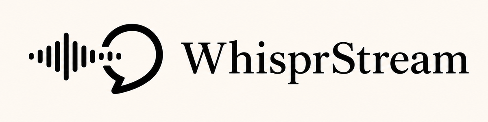

<p align="center">
  
</p>

<p align="center">Fast, private, multilingual dictation for Apple silicon Macs.</p>

<p align="center">
  <a href="https://youtube.com/shorts/bEcz2JkVLvw">
    
  </a>
</p>

WhisprStream is an open-source macOS dictation app that types at your cursor while you speak. It runs locally, keeps the model warm for low latency, and follows mixed-language sentences without uploading audio. Use it in any app—from notes and email to your terminal and coding agent.

## Highlights

- Live transcription with a floating HUD
- Multilingual dictation: switch languages mid-sentence, without being limited to Chinese and English—or to two languages at a time
- Custom vocabulary for names, technical terms, and jargon
- Voice shortcuts that expand a spoken phrase into a URL, signature, address, reusable reply, or any text you type often
- A configurable recording shortcut, including custom modifier chords and F13–F24
- Non-streaming models can still produce a live preview: WhisprStream repeatedly re-reads the growing utterance and settles the stable words
- No account, server, or audio upload

## Install WhisprStream

### Requirements

- macOS 14 or later
- Apple silicon Mac
- Approximately 4 GB free for the speech engine and recommended 0.6B model

### Download and first launch

1. Open [GitHub Releases](https://github.com/Leo6Leo/whispr-stream/releases), download `WhisprStream-macos-arm64.zip` from the latest published release, extract it, and move **WhisprStream** to Applications.
2. Open the app. Public builds are self-signed but not notarized, so the first launch may require **System Settings → Privacy & Security → Open Anyway**. Do not disable Gatekeeper.
3. Follow Setup Guide to download the private speech engine. The app checks free space, verifies the archive, installs it in Application Support, and runs a health check before using it.
4. Choose a speech model. Qwen3-ASR 0.6B is the recommended download at approximately 1.9 GB. Qwen3-ASR 1.7B is approximately 4.3 GB and is best suited to Macs with at least 16 GB of unified memory.
5. Grant Microphone and Accessibility access, or finish those steps later from **Settings → Permissions**.

The native app, speech engine, and model are separate. The engine and model are downloaded only when needed, remain on your Mac, and survive normal app updates. No Python, Homebrew, pip, Xcode, Terminal, account, or audio upload is required. See the full [installation and recovery guide](INSTALL.md).

### Experimental optional models

Custom Qwen3-ASR and MLX Whisper models are still under development. They are behind a compile-time feature gate and are not available in the public 1.0.2 build. Local source builds enable the experimental UI by default; use `ENABLE_OPTIONAL_MODELS=0 WhisprStream/build.sh` to reproduce the public behavior.

### Interrupted downloads and repair

- If an engine installation fails, open **Settings → Engine** and use **Install** or **Repair / Reinstall**. This replaces only the managed engine.
- If a model download is interrupted, open **Settings → Model** and choose **Clear Partial Data**. Cleanup is limited to unfinished files for that model; installed models and settings are untouched.
- A cancelled or crashed model download releases its lock automatically, so stale state cannot permanently block cleanup.
- **Settings → About → Check for Updates** downloads, verifies, installs, and relaunches stable updates in place. If the app is running from a read-only location, the same screen offers the GitHub Release page instead. The engine, model cache, preferences, vocabulary, and shortcuts are preserved.

### Build from source

Source builds require:

- Xcode
- Python 3.12

The developer setup remains:

```bash
./setup-mac.sh
WhisprStream/build.sh
open WhisprStream.app
```

Source builds use the prepared local development engine and show **Development engine ready** in Settings. Open **Settings → Model** to download a model. To exercise the download UI without changing real runtime or model files, quit the app and launch it with:

```bash
WHISPR_TEST_FIRST_RUN=1 WhisprStream.app/Contents/MacOS/WhisprStream
```

Hold the Right Option key, speak, and release; the transcript is inserted into the active app. To choose another trigger, open **Settings → General → Recording shortcut** and record a modifier chord or F13–F24. Right Option remains the default.

## Open source and model flexibility

WhisprStream is MIT licensed and designed to be inspected, adapted, and extended. The public 1.0.2 app offers the built-in Qwen3-ASR models. Experimental adapters for custom Qwen3-ASR and MLX Whisper checkpoints remain available to source-build developers behind a compile-time gate. A model does not need native streaming support: WhisprStream can repeatedly transcribe the full utterance, preserve context across language switches, and turn stable output into a live stream.

The native Swift front end and Python ASR sidecar communicate locally over a small newline-delimited JSON protocol. See [HANDOFF.md](HANDOFF.md) for architecture notes and troubleshooting.

## License

WhisprStream is available under the [MIT License](LICENSE).
