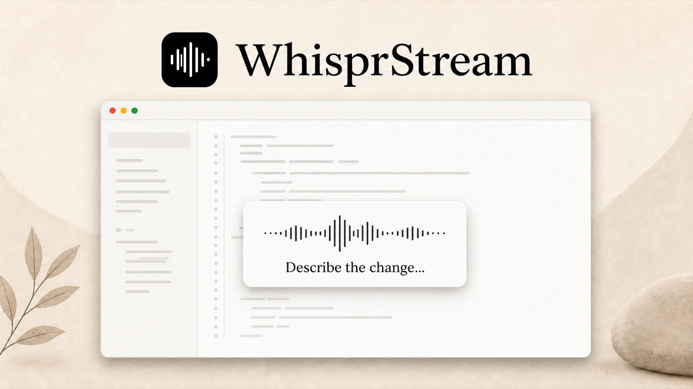

<p align="center">
  
</p>

<p align="center">Fast, private, bilingual dictation for Apple silicon Macs.</p>

<p align="center">
  
</p>

WhisprStream is an open-source macOS dictation app that types at your cursor while you speak. It runs locally, keeps the model warm for low latency, and handles mixed-language sentences without uploading audio.

## Highlights

- Live transcription with a floating HUD
- Chinese–English code-switching (and other supported languages)
- Custom vocabulary and voice shortcuts
- No account, server, or audio upload

## Requirements

- macOS 14 or later
- Apple silicon Mac
- Python 3.12 and Xcode

## Build and run

```bash
./setup-mac.sh
WhisprStream/build.sh
open WhisprStream.app
```

On first launch, open Settings → Model to download the speech model. Hold the Right Option key, speak, and release; the transcript is inserted into the active app.

The native Swift front end and Python ASR sidecar communicate locally over a small newline-delimited JSON protocol. See [HANDOFF.md](HANDOFF.md) for architecture notes and troubleshooting.

## License

WhisprStream is available under the [MIT License](LICENSE).
